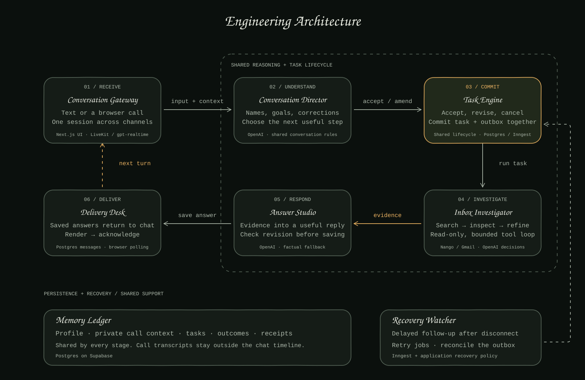
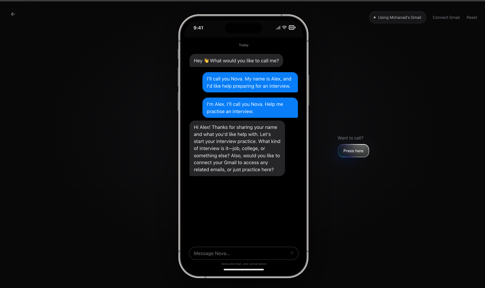

# Persona Trial

Conversational onboarding with chat, realtime voice, and Gmail.

[Try the demo](https://persona-hazel-alpha.vercel.app/chat)

## Flaws I found

- Hanging up left no proactive follow-up; call context could be unavailable in chat.
- Email searches could finish without delivering an answer until I asked again.
- A correction sent during processing could leave the assistant answering the earlier request.

## What I built

- Shared context across voice and text, with call transcripts kept out of the chat timeline.
- Durable tasks that continue after hangup, contextual recovery messages, and saved answers delivered in chat.
- Shared task acceptance/cancellation, revision checks to suppress stale results, retries, and delivery receipts.
- Immediate outgoing messages with sending status and retry, reconciled without duplicate bubbles.
- Native OpenAI realtime voice through LiveKit, Postgres state, Inngest jobs, and read-only Gmail through Nango.

## How to test

1. Name the assistant. Start a call, share your name, and ask it to find an email.
2. Hang up **after it accepts the task**. Check that the answer arrives in chat without prompting again.
3. Start another search, then correct or cancel it while it runs. Check that an obsolete result is not delivered.
4. Refresh to check persistence. **Reset** clears the conversation.
5. **Connect Gmail** clears the conversation and switches to your own inbox. Cancelling authorization leaves you disconnected.

The public demo defaults to my personal Gmail: anyone with the link can search it. Search is read-only; the app cannot send or draft emails. Also, you can connect you account if you want