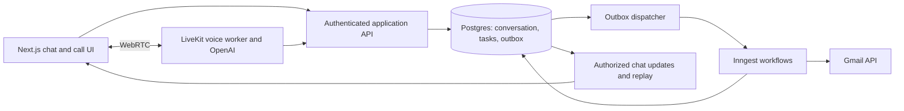

# Persona Trial: proposed backend architecture

Research checked 2026-09-27. The user has selected Next.js and authorized a frontend prototype plus parallel architecture planning. Every backend vendor and product policy below is a recommendation, not an accepted decision or implemented capability. The current frontend must identify simulated voice, Gmail, and task results accurately.

## Outcome and boundaries

Build one assistant whose conversation persists across chat, calls, refreshes, and worker restarts. Attempt assistant naming, user naming, Gmail authorization, and a useful request without blocking useful work on refused setup. A call attempt covers the latter three; authorization itself still happens through a browser consent flow.

The motivating observations are missing call context after a mid-speech hangup and an email search whose answer appeared only after another prompt. Their backend causes are unknown. Our acceptance criteria should reproduce the observable situations without asserting a diagnosis of Persona.

## Recommended stack

| Responsibility                           | Initial choice                      | Reason                                                                                       |
| ---------------------------------------- | ----------------------------------- | -------------------------------------------------------------------------------------------- |
| Web experience and short API requests    | Next.js, TypeScript, Vercel         | Matches the requested frontend and gives a straightforward preview deployment.               |
| Identity and durable application data    | Supabase Auth and Postgres          | One transactional store for conversations, facts, tasks, results, and pending notifications. |
| Browser voice transport and agent worker | LiveKit Agents on LiveKit Cloud     | Managed media and persistent agent hosting with a coherent debugging path.                   |
| Voice intelligence                       | Hosted OpenAI realtime speech model | Avoid custom GPU serving; validate available model and SDK compatibility before pinning it.  |
| Background execution                     | Inngest, TypeScript                 | Retriable steps and durable waiting suit this small event-driven application.                |
| Mail access                              | Gmail API, initially read-only      | Search and summarize mail; compose proposed replies in chat before expanding permissions.    |

LiveKit offers managed agent deployment; Inngest documents retriable workflow checkpoints. Neither supplies our application policy or durable conversation model automatically. [LiveKit deployment](https://docs.livekit.io/deploy/agents/), [Inngest functions](https://www.inngest.com/docs/learn/inngest-functions).

Vercel functions have execution limits. Keep the long-lived media worker in its intended runtime, with web routes handling authentication, token issuance, events, and reads. [Vercel limits](https://vercel.com/docs/functions/limitations).

## One assistant, explicit responsibilities

Start with one conversational agent and typed tools. A policy layer chooses the next useful question from missing information, refusals, and active work. Tools validate identity, arguments, and permissions; a worker executes accepted tasks. Avoid separate autonomous agents for naming, onboarding, Gmail, and recovery: coordinating their competing conversational state adds little value here.

Persist authoritative changes through the same application commands regardless of channel. A voice session is a temporary participant in a durable conversation, never its sole owner.

## State that survives the call

Use ordinary tables plus an append-only event history, without building a general event-sourcing platform:

- **Conversation:** owner, current revision, assistant name, deferred onboarding fields, active call identifier.
- **Input evidence:** channel, provider item identifier, sequence, revision, partial/final status, captured text, timestamps.
- **Accepted facts:** value, evidence reference, acceptance status, superseded fact identifier.
- **Task:** stable identifier, normalized request, request revision, execution state, cancellation state, structured result.
- **Message:** stable identifier, conversation sequence, content, related task, persisted timestamp.
- **Outbox:** event identity, payload reference, pending/sent state, attempt count, next attempt time.
- **Integration:** owner, provider, granted scopes, connection status; encrypted credentials are server-only.

Deduplicate provider events by stable identity. Allocate conversation order server-side and use revision checks when accepting corrections. An old voice extraction must not overwrite a newer typed correction. Queue concurrency controls alone are insufficient for this: Inngest limits active steps and documents best-effort ordering, so database checks still enforce correctness. [Concurrency semantics](https://www.inngest.com/docs/guides/concurrency).

## Preserve input without pretending uncertainty is certainty

Persist received transcript fragments as evidence independently of an assistant response. Partial speech recognition can change: “My name is Sam… actually, Samantha” should not become two permanent facts. Accept a complete, sufficiently clear request through a validated command; ask a targeted question when a required argument remains incomplete.

Verify exactly when the selected model and transport emit input transcripts. “Realtime” does not guarantee every unfinished utterance is already available to the application. OpenAI documents incremental and completed transcription events, with item identities used for ordering; implement against the selected API's actual events. [Realtime transcription](https://developers.openai.com/api/docs/guides/realtime-transcription).

For a deliberate End Call click, stop microphone capture and allow bounded finalization before tearing down the server session. For an abrupt disconnect, preserve received evidence, mark finalization incomplete, and recover from what exists. If reliable pre-turn capture requires an additional streaming transcriber, evaluate its latency, cost, and retention implications in the voice spike. Never promise recovery of audio that never reached a service.

Track assistant playback separately: generating a sentence does not prove the user heard it. Rehydrate new voice sessions from accepted facts, recent messages, pending tasks, and relevant evidence rather than blindly replaying an entire raw transcript.

## Durable work and result delivery

Proposed flow for an email search:

1. Commit the accepted task and a `task.requested` outbox record in one database transaction. Only then acknowledge tracked work.
2. Dispatch the outbox event under the task identity. A periodic reconciler handles missed dispatches; duplicate dispatch remains safe.
3. Execute Gmail retrieval and answer composition as separate durable steps. Bound retries and retain structured retrieval results if composition fails.
4. In one transaction, save the result, final chat message, and notification obligation. Use a unique task-result revision to prevent duplicate messages.
5. Push the persisted message to connected clients. On reconnect, replay messages after the client's last sequence. Record transport acknowledgement separately from persistence; do not claim a read receipt.
6. Surface exhausted retries as an explicit failure with a retry option. A successful tool call alone must never produce a misleading “done” state.

The transactional outbox addresses the gap between a database update and event delivery; consumers still need idempotency. [AWS outbox pattern](https://docs.aws.amazon.com/prescriptive-guidance/latest/cloud-design-patterns/transactional-outbox.html).

LiveKit async tools can keep conversation responsive while work runs, but a session task is not our crash-durable task. The voice tool should enqueue or observe the durable task and present progress. [LiveKit async tools](https://docs.livekit.io/agents/logic/tools/async/).

Proposed hangup policy: accepted read-only work continues and returns in chat; explicit cancellation stops further work where possible and suppresses stale results. A fragment gets clarification. Schedule at most one relevant recovery message, checking the latest conversation revision before sending; suppress it when the user has already resumed, cancelled, or said goodbye.

## LiveKit versus direct OpenAI

Direct browser-to-OpenAI WebRTC is a credible smaller voice prototype. A server sideband can observe the session and execute private tools, while credentials and authorization remain server-side. It still requires persistent application state and a suitable runtime for the server connection. [OpenAI server controls](https://developers.openai.com/api/docs/guides/realtime-server-controls).

Prefer LiveKit for the initial full demo if its deployment, event visibility, and session lifecycle save integration work. Choose direct OpenAI if the bounded spike proves it simpler while satisfying the same disconnect tests. Pipecat is also viable; prior comparison notes establish no measured quality or latency winner. Do not introduce multiple voice frameworks into the first submission.

## Gmail and growth

Real Gmail connection requires OAuth and adequate scopes. `gmail.readonly` is restricted; verify testing-user configuration and applicable verification requirements before promising public access. An openly labeled sample inbox lets evaluators explore immediately, but must never appear connected to their account. [Gmail scopes](https://developers.google.com/workspace/gmail/api/auth/scopes).

Enforce ownership on every read and command; apply database row policies to exposed tables. Keep service credentials off clients, validate callbacks, and treat email contents as untrusted data rather than instructions. [Supabase row security](https://supabase.com/docs/guides/database/postgres/row-level-security).

Begin in one region, with bounded call duration, per-user task limits, provider quotas, and an agreed spend ceiling. Measure before scaling: concurrent calls, worker admission delay, database connections, job backlog, and provider throttling matter more than registered-user count. Scale voice workers and background jobs independently; index conversation sequence and pending outbox queries. Introduce Temporal only if workflow complexity or operational requirements justify migration, not to decorate the demo architecture.

## Proof before expanding

Automate hangup mid-request, refresh during search, worker death after result persistence, duplicate callbacks, denied microphone, Gmail refusal/revocation, and concurrent name correction. Verify isolated reviewer sessions and cancellation against delayed results. Measure first audible response separately from useful-answer latency, and result readiness separately from chat delivery. The demo is credible when these boundaries are visible and repeatable; implementation and hosting remain subsequent work.
